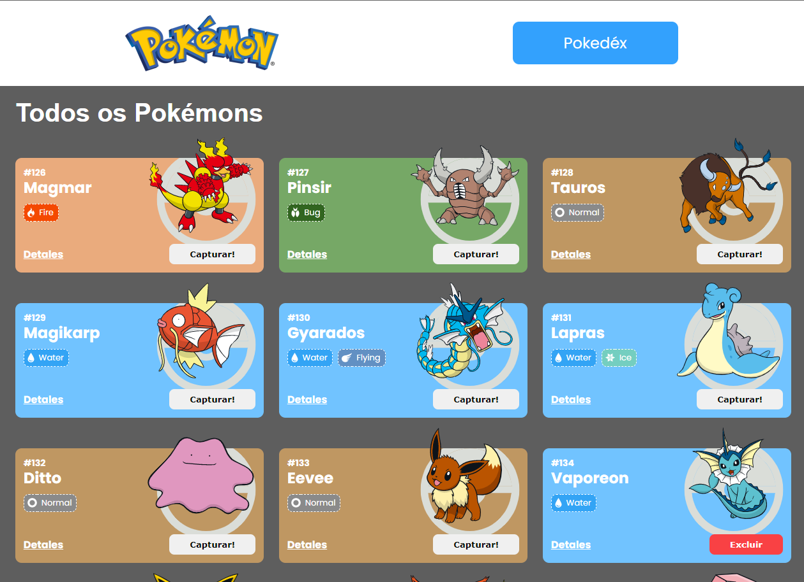
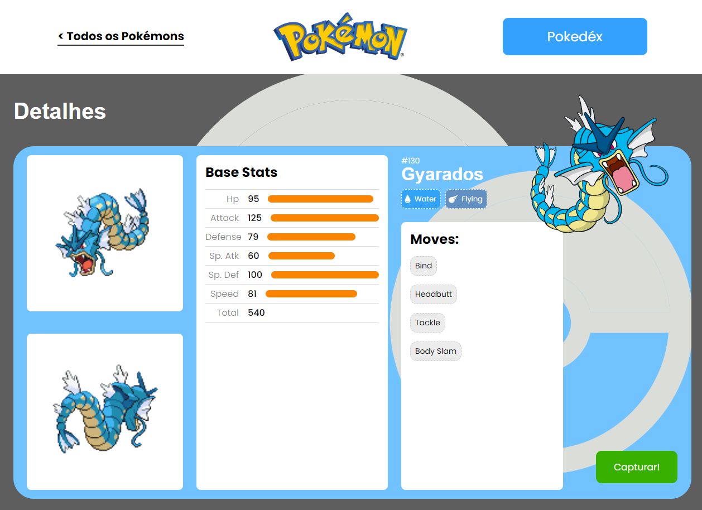
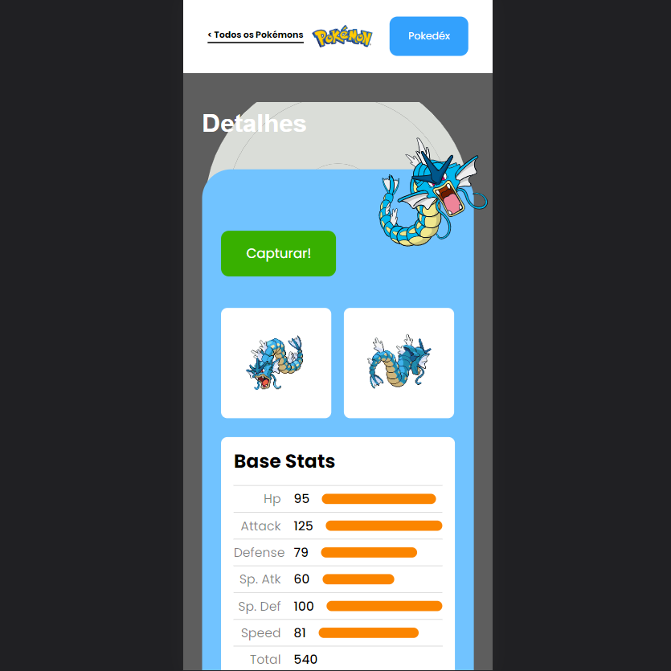
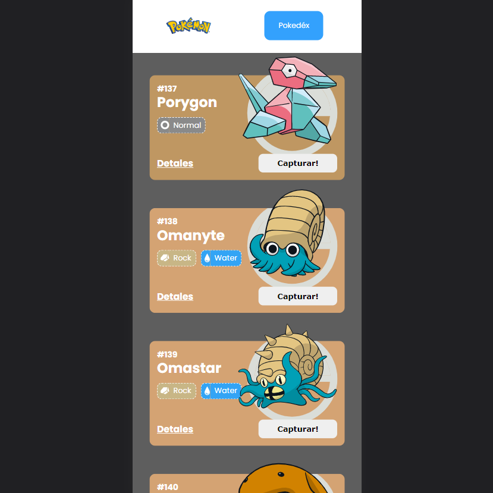

<h1 align="center">Pokédex</h1>

> Project Status: completed :heavy_check_mark:


## Topics

:small_blue_diamond: [Layout](#-layout)

:small_blue_diamond: [Application Deploy](#-application-deploy)

:small_blue_diamond: [Project Description](#-project-description)

:small_blue_diamond: [Functionalities](#-functionalities)

:small_blue_diamond: [Technologies](#-technologies)

:small_blue_diamond: [Prerequisites](#warning-prerequisites)

:small_blue_diamond: [How to run the application](#how-to-run-the-application-arrow_forward)

:small_blue_diamond: [Developers](#developers-octocat)

:small_blue_diamond: [License](#memo-license)


## 🎨 Layout

<p aling="center">
 
 
 
 
 
</p>


## 🚀 Application Deploy

> Live Preview: LINK AQUI


## 💻 Project Description

<p align="justify">

**<h3>Pokédex:</h3>**

 - É uma aplicação web que tem como objetivo capturar ou remover os pokemons da sua pokédex.

 - A aplicação é totalmente responsiva para todas as telas. 
 
 - Está aplicação tem 3 páginas, Home, Details e Pokédex.

 - Ela foi desenvolvida usando as seguintes tecnologias: JavaScrips, React, React Router Dom, Poke API, Styled-Components and Vercel.
   
</p>


## 🎓 Functionalities

*<h3>This application has:</h3>*

 - **Page Home:**

     :heavy_check_mark: Mostra uma lista de Pokemons;

     :heavy_check_mark: Em cada card de Pokemon tem um botão para adicioná-lo à Pokedex e um outro botão para acessar os detalhes do Pokemon;

 - **Page Details:**

      :heavy_check_mark: Renderizar a lista de pokémons adicionados na pokedex;

- **Page Pokédex:**

     :heavy_check_mark: Mostrar os detalhes do Pokemon selecionado, com informações descritas


## 🧰 Technologies

*This project was developed with the following technologies:*

- [React.JS](https://pt-br.reactjs.org/)
- [Poke API](https://pokeapi.co/)
- [Styled Components](https://styled-components.com/)
- [JavaScript](https://www.javascript.com/)
- [React Router Dom](https://reactrouter.com/en/main)
- [Vercel](https://vercel.com/)
- [Node.JS](https://nodejs.org/)
- [Git and Github](https://git-scm.com/)


## How to run the application :arrow_forward:

*In the terminal, clone the project:*

```
git clone https://github.com/BarbosaThaissa/pokedex
npm install
npm run dev
```


## Developers :octocat:

<br>

| [<br><sub>Thaíssa Barbosa</sub>](https://github.com/BarbosaThaissa) | 
| :---: 


## :memo: License

*This project is under the MIT license*

<p aling="center">
 
</p>


**Copyright :copyright: 2023 - CineInfo**


Made with 💜 by myself : [My contact!](contatothaissabarbosa@gmail.com)